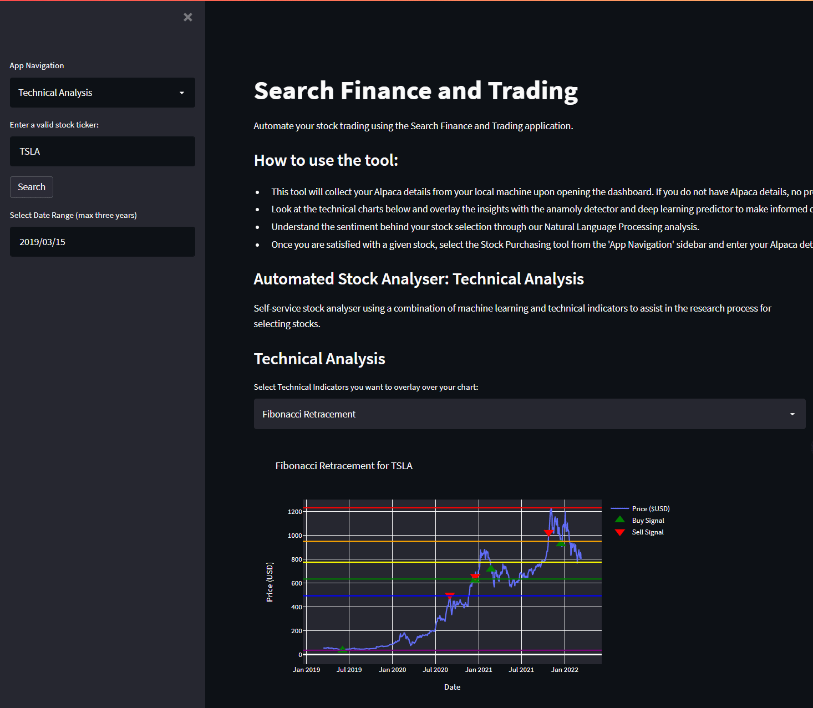
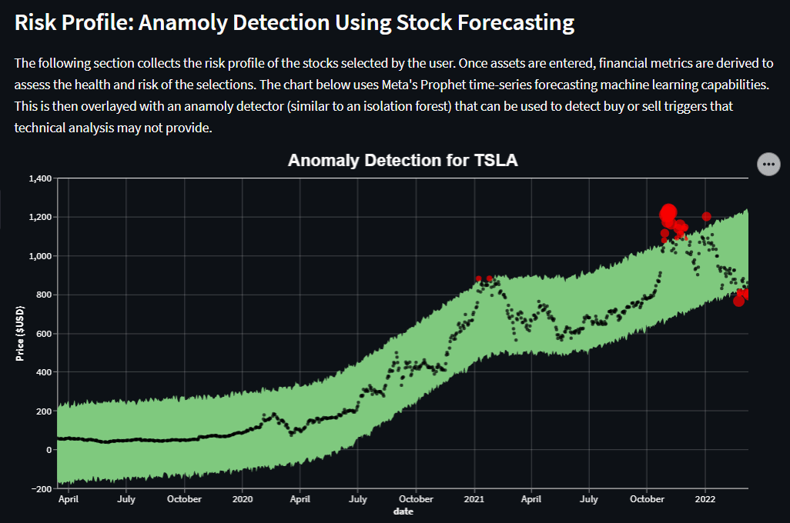
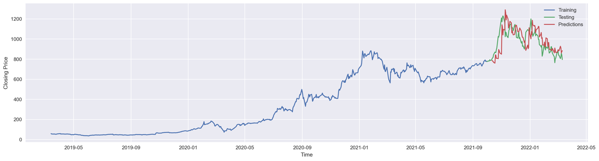
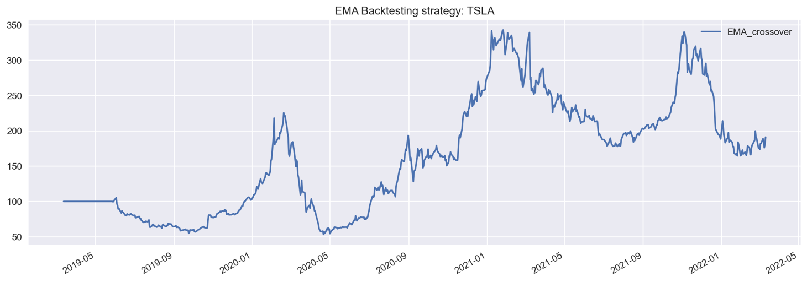
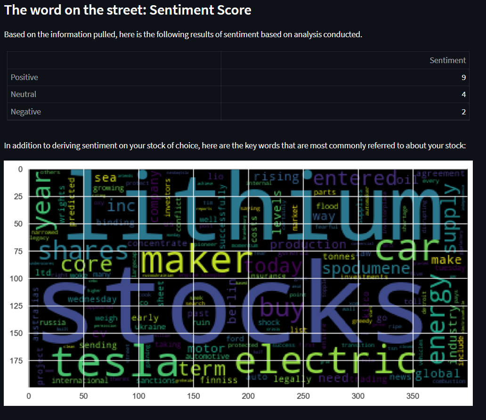
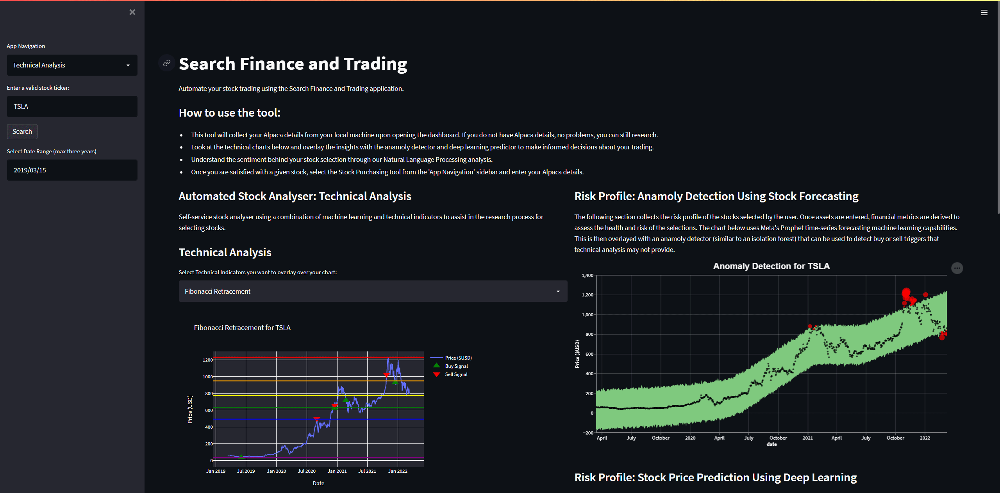

# FinTech-Project-2
​
# Search Finance & Trading
​
​

​
# Team Members
- Mitchell Langdon 
- Marcus Whitelock
- Christian Seeley 
- Mohamed Dallol 
- Ilisha Kaul
​
# Project Description/Outline
​
- ### Could we create a technical stock analysis, for profitbale trades?

- ### Could we create a automated trading bot for profitable passive income?

- ### Can a tool be built that is dynamic, that produces meaningful and actionable insights for potential investors?
​
​
# Analysis Report
## Data collection:

There were two primary data sources used to collect data for our analysis, including:
 * [Stock News API](https://stocknewsapi.com/); and 
 * [Alpaca API](https://app.alpaca.markets/brokerage/new-account/overview); and
 * Yahoo Finance API

 API calls were made to each of the data sources, to create a dynamic method of capturing and presenting data back to the individual via Streamlit (Python dashboard application).
​
## We have data ! Lets see what we can do with it.
​ 
​
​
​
​
# We have the data now lets use it to predict and trade

Deep learning models and linear regression models were utilised to inform trading decisions and make predictions. The anamoly detector (using linear regression) shows prices on a time-series that warrant further investigation. See the graphic below.

The deep learning model uses a Long Short Term Memory neural net to make predictions. The key concern with the deep learning model is overfitting (or have we simply trained the model efficiently?)... 

We then also use this information to backtest specific strategies. Take for example, the exponential moving average strategy for TSLA:

Lastly... what's everyone saying about the stock? What are the key words that constantly arise in news articles? Our natural language processing techniques can tell you: 

We could then make a trading decision. Let's go ahead and buy Tesla given our predictions, strategies and sentiment have confirmed our purchase:
​

# Future opportunities

 * With additional time, we could explore a fully automated trading strategy that combines technical, sentiment and machine learning techniques to make trading decisions. 

* Enhance the processing power of the dashboard. When loading a stocks information, the API calls to the stock news API can take minutes to load, leading to a poor experience. Also running a dynamic neural network takes up quite a significant amount of processing power.

